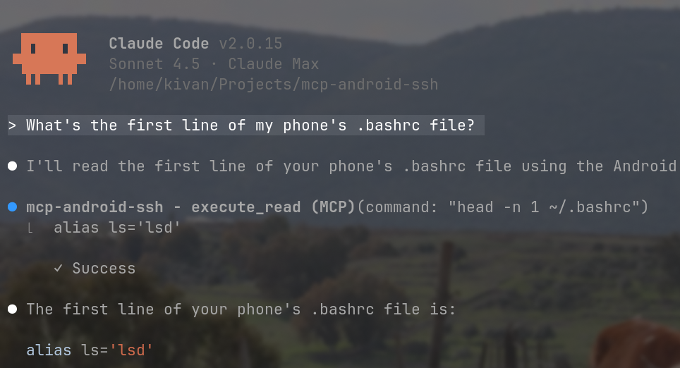

<div align="center">

# Android SSH MCP Server

**Control your Android device from AI assistants via SSH**

[](https://opensource.org/licenses/MIT)
[](https://www.rust-lang.org/)
[](https://crates.io/crates/mcp-android-ssh)

A high-performance [MCP](https://modelcontextprotocol.io/) server written in Rust that provides secure SSH access to Android devices through Termux.



*Example: AI assistant listing files and exploring directories on Android*

</div>

---

## Why Use This?

Turn your Android device into a programmable computer that AI can interact with naturally. Instead of manually SSH'ing into your phone every time you need to check something or run a command, just ask Claude:

- "Check if my Termux background service is running"
- "Download this paper to my tablet"
- "Find all PDFs on my device larger than 10MB"

## Features

- **Interactive setup tool** - Configure through natural conversation with Claude
- **Lightweight & fast** - 401 KiB binary, memory-safe Rust implementation
- **Smart safety** - 81 whitelisted read-only commands run freely, writes require explicit tool
- **Bulletproof connectivity** - Auto-reconnect with retry logic, handles network drops
- **Flexible auth** - SSH key or password authentication
- **Privacy-first** - Local-only connection, no data leaves your network

## Quick Start

```bash
# Install
cargo install mcp-android-ssh
claude mcp add --scope user --transport stdio mcp-android-ssh mcp-android-ssh

# Setup Termux (on Android)
pkg install openssh && sshd

# Copy your SSH key
ssh-copy-id -p 8022 -i ~/.ssh/id_ed25519.pub u0_a555@192.168.1.100

# Configure via Claude (recommended) - just ask:
"Set up Android at 192.168.1.100, user u0_a555, key ~/.ssh/id_ed25519"
# Then restart from /mcp menu

# Or manually edit: ~/.config/mcp-android-ssh/config.toml
```

<details>
<summary><b>Detailed Setup Guide</b> (click to expand)</summary>

## Detailed Setup

### Installation & Configuration

**Step 1: Install and add to Claude Code**

```bash
cargo install mcp-android-ssh
claude mcp add --scope user --transport stdio mcp-android-ssh mcp-android-ssh
```

**Step 2: Setup your Android device**

In Termux on your Android device:
```bash
# Install and start SSH server
pkg update && pkg install openssh && sshd

# Find your username and IP address
whoami          # Example: u0_a555
ifconfig wlan0  # Example: 192.168.1.100
```

**Step 3: Setup SSH key authentication (recommended)**

On your host machine:
```bash
# Generate SSH key (skip if you already have one)
ssh-keygen -t ed25519 -f ~/.ssh/id_ed25519 -N ""

# Copy key to Android (replace with your username and IP)
ssh-copy-id -p 8022 -i ~/.ssh/id_ed25519.pub u0_a555@192.168.1.100
```

**Step 4: Configure the server**

**Option A: Let Claude configure it (easiest)**

Just ask Claude to set it up:
```
"Set up my Android connection at 192.168.1.100, user u0_a555, use ~/.ssh/id_ed25519"
```

Then restart the MCP server from the `/mcp` menu in Claude Code.

**Option B: Manual configuration**

Edit `~/.config/mcp-android-ssh/config.toml`:

```toml
host = "192.168.1.100"        # Your Android device IP
port = 8022                    # SSH port (default 8022 for Termux)
user = "u0_a555"               # Your Termux username
key_path = "~/.ssh/id_ed25519" # Path to your SSH private key

# Optional: password authentication (not recommended)
# password = "your_password"
```

**Option C: Use environment variables**

Configure via environment variables (useful for testing):
```bash
export ANDROID_SSH_HOST=192.168.1.100
export ANDROID_SSH_USER=u0_a555
export ANDROID_SSH_KEY_PATH=~/.ssh/id_ed25519
```

That's it! Start asking your AI assistant to interact with your Android device.

</details>

---

## Usage Examples

**File Management**
- "Show me my most recent photos from /sdcard/DCIM"
- "Find all PDF files larger than 10MB"
- "What's taking up the most space on my phone?"

**Development & Monitoring**
- "Check if my PostgreSQL server is running"
- "Show me running processes sorted by memory"
- "Show me the last 50 lines of my server logs"

**System Administration**
- "Install python and pip on my device"
- "Create a backup of my Termux home directory"
- "Download this dataset to /sdcard"

**Data Analysis**
- "Find duplicate files in my photos"
- "Analyze my app usage with dumpsys"

---

## API Reference

The server exposes three MCP tools that Claude can use:

### `execute_read` - Safe Read-Only Commands

Executes whitelisted read-only commands without user approval. Perfect for browsing files, checking system status, and gathering information.

**81 Whitelisted Commands Include:**
- File operations: `ls`, `cat`, `head`, `tail`, `grep`, `find`, `tree`
- System monitoring: `ps`, `top`, `df`, `du`, `free`, `uptime`
- Network: `ping`, `netstat`, `ss`, `ifconfig`
- Text processing: `wc`, `sort`, `cut`, `jq`
- [See full list in source](src/tools.rs#L13-L135)

**Parameters:**
- `command` (string, required) - The shell command to execute
- `timeout` (number, optional) - Timeout in seconds (default: 30, max: 300)

**Example:** `ls -lah /sdcard/Download`

---

### `execute` - Full Command Access

Executes any command including write/modify/delete operations. Use this for installing packages, creating files, or modifying system state.

**Parameters:**
- `command` (string, required) - The shell command to execute
- `timeout` (number, optional) - Timeout in seconds (default: 30, max: 300)

**Example:** `pkg install git`

**Note:** Commands that aren't whitelisted in `execute_read` will automatically suggest using this tool instead.

---

### `setup` - Interactive Configuration Helper

Configure your Android SSH connection directly through Claude. Supports partial updates and guides you through missing information.

**Parameters (all optional):**
- `host` (string) - Android device IP address
- `port` (number) - SSH port (default: 8022)
- `user` (string) - Termux username
- `key_path` (string) - Path to SSH private key
- `password` (string) - SSH password (not recommended)

**Usage:**

Complete setup in one go:
```
"Set up Android at 192.168.1.100, user u0_a555, key ~/.ssh/id_ed25519"
```

Or step-by-step - Claude will ask for missing info:
```
"Help me set up my Android connection"
```

Update just one field:
```
"Change the host to 192.168.1.101"
```

After setup completes, restart the MCP server from the `/mcp` menu.

---

## Acknowledgments

- [rmcp](https://github.com/modelcontextprotocol/rust-sdk)  
- [russh](https://github.com/warp-tech/russh)
